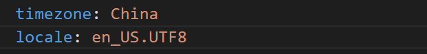

# Linux第一章实验报告

## 实验目的：实现Linux系统虚拟机的无人值守安装

## 软件环境：Virtualbox、Ubuntu 20.04 Server 64bit、宿主机Windows10系统

## 一、实验步骤

### 1.下载ubuntu-20.04.2-live-server-amd64.iso镜像文件，下载之后在命令行中用SHA256算法计算，并与官方的结果进行对比

### 2.在虚拟机中手动安装第一个虚拟机--ubuntu20.04系统，命名为ub20.04.2-hft,手动安装会等待很长时间

### 3.下载autoinstall-user-data文件并进行修改
#### (1)首先在cmd中用ssh与虚拟机连接

#### (2)为了拷贝文献，需要获取权限，可用sudo chown语句修改属主

#### (3)到宿主机上将文件拷贝到本地，进行修改

### 4.用meta-data和user-data文件制作自己的ISO镜像（meta-data可为空文件，但是必须要有），并命名为focal-init-hft.iso

### 5.新建第二个虚拟机，命名为ub20.04-hft-clone,在设置-存储中移除上述虚拟机控制器IDE,在控制器SATA下建2个虚拟光盘，按顺序先挂载纯净Ubuntu安装镜像文件，后挂载focal-init-hft.iso

### 6.启动虚拟机，看到'Continue with autoinstall? (yes|no)'命令后输入yes,开始接放双手，进行无人值守

### 7.无人值守成功，正常进入系统

## 二、实验问题及解决方法

### 1.在下载autoinstall-user-data文件时，总是遇到如下问题，不能创建目录，如下图所示

#### 根据老师给的提示，在语雀上发现了存在同样问题的同学的提问，此可能为默认目录带有中文用户名的原因，经过和同学的交流，在同学的帮助下，了解到可以用git bash代替命令行进行输入，现已成功下载文件，问题已解决(具体详细过程可参照语雀上的回答，链接如下：<https://www.yuque.com/c4pr1c3/linux/ttkz7y#comment-9888020>)

### 2.实验教训：一定要注意仔细核对老师进行示范的实验步骤，不能马虎！！！

### 3.用ifconfig -a可以查看虚拟机的所有网卡

### 4.如何使用sftp在虚拟机和宿主机之间传输文件

#### 答：经查询资料，可利用SecureCRT的sftp进行Windows和linux之间的文件传输(参考链接：<https://www.cnblogs.com/xwdreamer/p/3673397.html>)

