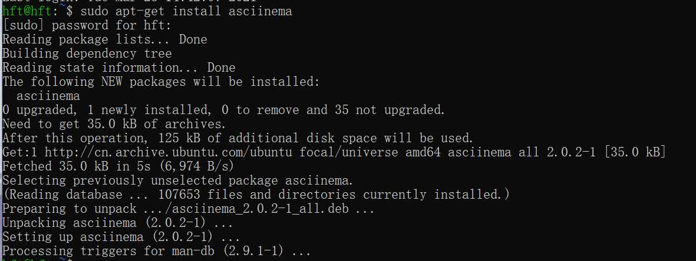
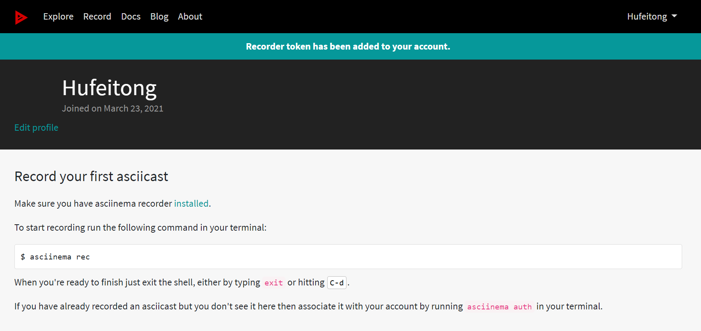

# Linux第二章实验报告

## 软件环境：Virtualbox、Ubuntu 20.04 Server 64bit、宿主机Windows10系统

## 实验步骤
* 在asciinema注册一个账号，并根据官方提供的指令在本地安装配置好asciinema

* 确保本地已经完成asciinema auth，并在asciinema成功关联了本地账号和在线账号
  

* 在命令行中查看文档并按照文档进行相应操作

## vimtutor操作全程录像链接

*  lesson1.1&1.2
  

* lesson1.3
  

* lesson1.4
  

* lesson1.5
 

* lesson1.6
  

* lesson2.1&2.2
  

* lesson2.3--2.7
  

* lesson3.1
  

* lesson3.2--3.4
  

* lesson4.1
  

* lesson4.2
  

* lesson4.3&4.4
  

* lesson5.1&5.2
  

* lesson5.3&5.4
  

* lesson6.1
  

* lesson6.2&6.3
  

* lesson6.4
  

* lesson6.5
  

* lesson7.1
  

* lesson7.2
  

* lesson7.3
  

## vimtutor完成后的自查清单
* 你了解vim有哪几种工作模式？
  命令模式、输入模式、编辑模式

* Normal模式下，从当前行开始，一次向下移动光标10行的操作方法？如何快速移动到文件开始行和结束行？如何快速跳转到文件中的第N行？
  10j可以向下移动10行；输入大写G可以使当前光标直接跳转到文件最后一行；输入gg可以使得当前光标跳转到第一行；通过输入:N可以直接移动光标到文件第N行

* Normal模式下，如何删除单个字符、单个单词、从当前光标位置一直删除到行尾、单行、当前行开始向下数N行？
  x：删除单个字符
  de：从当前光标位置删除到单词末尾
  d$：从当前光标删除至当前行末尾
  dd:删除当前一整行
  Ndd:删除N行

* 如何在vim中快速插入N个空行？如何在vim中快速输入80个-？
  输入小写o可以在光标下方打开新的一行并进行插入模式
  插入N个空行：  80o
  插入80个- ：  80i-

* 如何撤销最近一次编辑操作？如何重做最近一次被撤销的操作？
  输入u来撤销最后执行的命令
  输入U来撤销对整行的修改

* vim中如何实现剪切粘贴单个字符？单个单词？单行？如何实现相似的复制粘贴操作呢？
  使用v进入可视模式，输入y复制高亮的文本，然后移动光标至空白处，输入p进行粘贴
  d:进行剪切操作
  dw:剪切单个单词
  dd:剪切一行
  

* 为了编辑一段文本你能想到哪几种操作方式（按键序列）？
  (1)先输入:!dir获取当前目录的内容，选择未使用过的文件名，然后再输入:!dir查看当前目录
  (2)移动光标到某一行，按v，将光标移动至想要选择的位置，然后按：,输入w TEST(未使用文件名)，将选中行写入TEST
  (3)r:FILENAME   向当前文件中插入另外文件的内容
  

* 查看当前正在编辑的文件名的方法？查看当前光标所在行的行号的方法？
  CTRL+G：显示当前编辑的文件名和文件中光标的位置

* 在文件中进行关键词搜索你会哪些方法？如何设置忽略大小写的情况下进行匹配搜索？如何将匹配的搜索结果进行高亮显示？如何对匹配到的关键词进行批量替换？
  /ignore    搜索ignore词，重复查找可以按n
  :set ic    忽略大小写
  :set hls is    进行高亮显示
  :%s/old/new/g  在文件内替换所有的字符串old为新的字符串new

  
* 在文件中最近编辑过的位置来回快速跳转的方法？
  曾经停留的行号+G可以返回第一次按下CTRL+G的位置
  
* 如何把光标定位到各种括号的匹配项？例如：找到(, [, or {对应匹配的),], or }
  把光标放在左括号处，按%字符，此时光标的位置在配对括号处

* 在不退出vim的情况下执行一个外部程序的方法？
  :!然后紧接着输入一个外部命令即可

* 如何使用vim的内置帮助系统来查询一个内置默认快捷键的使用方法？如何在两个不同的分屏窗口中移动光标？
  输入:help打开帮助窗口,如：输入:help cmd可以找到关于cmd命令的帮助
  （1）Ctrl+w+k 上一个窗口   Ctrl+w+ j  下一个窗口 
  （2）Ctrl+w+上下方向键

